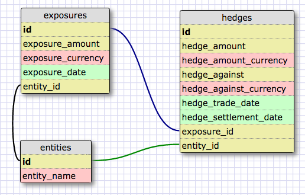

# FX-HEDGE-MGT
Manage foreign currency exposures and outstanding hedges

User Stories
============

Add FX exposure
------------
Add an exposure currency, amount, date

Calculate FX exposure by currency/month
---------------------------------------
Subtotal exposures by currency/month

Add FX hedge
------------
Add a hedge with trade date, settlement date, and amounts

Calculate FX hedge coverage by currency/month
---------------------------------------------
Subtotal exposures and hedges with a corresponding hedge coverage %

Find natural offsets with other entities
----------------------------------------
Determine if a natural offset exists before executing a hedge

DB Schema
=========

